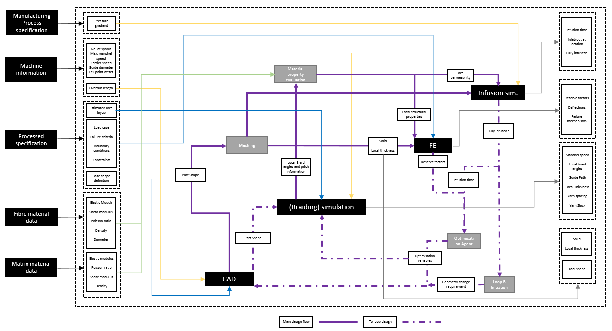

# SySi
System of simulation for holistic composite design.The purpose of this collection of scripts is to demonstrate an alternative approach to design of aerospace composite components. Script generated models and simulation setups are used to allow for multi-simulation optimisation.
## User: Quick start guide 
This section of the documentation walks user through the minimal steps required to run one trial run of the System of Simulations. 
| | Pre-requisite | |
| --- | --- | --- |
| 1 | CATIA installation | 5.27.4 tested, but other versions should work
| 2 | Python libraries | lhsmdu, sklearn, PySimpleGUI, pyodbc, time,math, subprocess, bokeh, sys, pywin32,  os,numpy, (installing through requirements.txt should be possible “pip install -r requirements.txt”) |
| 3 | SQL Server Database | After SQL server is installed, database has to be configured. User needs to create “sql_config.txt” file in the main script directory. The information that should be stored in each line is as follows: user ID, password, SQL driver, server, database name. Example of how the file should look is shown on figure below. After the “sql_config.txt” file is ready, user can run “sql_setup.py” which creates all tables required. Default resin and fibre materials are also saved to relevant tables. |
| 4 | Abaqus installation | This includes built-in python libraries (2018 version tested) |

##### Figure 1 – configuration file for SQL server 

Running IDP_GUI.py displays various iteration options. It is recommended that for the first run user selects “mandrel_speed”, “no_layers”, and “spools” as the “altered variables”. In the “MAIN” tab user then needs to press run only. This combination of parameters has been well tested and should run smoothly. The progress can be checked by reviewing newly generated tables in the SQL database. 

 

## Developer Guide 

The scripts available here are part of an EngD project. The project aims to use scripts and good data management to allow for more complete design and optimization of braided composite components. Variables are shared between simulations, and an overall fitness function determines value of each optimization iteration. 

The difference between the proposed design strategy and standard design approach is outlined by figure 1. In short, more time is spent developing automatically generated models, which minimizes the amount of work required for design iterations. The scripts in the form presented here are demonstrator of this approach.  

.png)
##### Figure 2 – Suggested alternative design approach 

The demonstrator was developed for a braided composite part suitable for resin infusion. The part should represent a generic small UAV spar. 

##### Figure 3 – example variable flow map 

It is assumed that different users will find different aspects of the complete system of simulations useful. For that reason, the documentation is structured by modules of the system, which allows user to either pick only the module that is of interest or replace a module by their own set of scripts. 

The system of simulation is under the development, and not all of optimisation options are fully tested. Hence, no guaranties are given about the functionality. It might also include hashed sections of unused code from other iterations, that are considered for future use. 

The main aspect of the EngD work is the altered design process. The scripts here are an example of the result, but for a new part-line it is expected that similar set of scripts will be developed from scratch. The framework can be reused and the mechanics of how variables are passed can also be maintained. However, the individual modules will require newly developed model creation automation. 

The envisioned use of this library consists of brief review of how the system of simulation should look once finished, and then informed recreation of the scripts for bespoke purposes. A process manual for the envisioned design approach will be provided in the EngD thesis. 

The flow of variables through the different simulations, governed by the scripts, is outlined on figure 2. 

### License  

Ellutze/sysi is licensed under the MIT License. 

#### MIT License 

A short and simple permissive license with conditions only requiring preservation of copyright and license notices. Licensed works, modifications, and larger works may be distributed under different terms and without source code. 

### Publications 

(pending) 

### Pre-requisites  

To run the exact complete simulation presented here, several pre-requisites exist.  

| | Pre-requisite | Essential | |
| --- | --- | --- | --- |
| 1 | CATIA installation (5.27.4 tested) | no | Currently the CATIA module removal will only affect itself and PAM-RTM (see CATIA module for details) |
| 2 | Python libraries | yes | lhsmdu, sklearn, PySimpleGUI, pyodbc, time,math, subprocess, bokeh, sys, pywin32,  os,numpy |
| 3 | SQL server database | yes | Implementation of MySQL option requires some adjustments (instructions not available yet) |
| 4 | Abaqus installation (2018 version tested) | yes | This includes built-in python libraries, documentation available with Abaqus |
| 5 | PAM-RTM | no | Not currently used for the holistic optimisation output. Built-in python library is extensively used.  |#

## Installation 

Repository from GitHub can be cloned into pretty much any folder. It should be taken into account that the scripts save simulation files in the subfolders. 

## SQL server installation 

SQL sever needs to be installed for the scripts to work. User is expected to set up an empty database. The details of the database should than be saved in main project folder (where the scripts are) with the file name “sql_config.txt”. The information that should be stored in each line is as follows: user ID, password, SQL driver, server, database name. Example of how the file should look is shown on figure 1. 

After the “sql_config.txt” file is ready, user can run “sql_setup.py” which creates all tables required for global optimisation runs. Default resin and fibre materials are also saved to relevant tables. 

Similar process can be done for MySQL option, using “mysql_setup.py”. However, this is currently not tested and it is possible that some of the code in other files will need amending for the different syntax. 

## Test run 

Running IDP_GUI.py displays various iteration options. It is recommended that for the first run user selects “mandrel_speed”, “no_layers”, and “spools” as the “altered variables”. In the “MAIN” tab user then needs to press run only. This combination ofparameters has been well tested and should run smoothly. The progress can be checked by reviewing newly generated tables in the SQL database. 

## Common errors  

(under development) 

## Modules  

Full description of modules might be provided later. At the moment, this section includes most practical notes on each of the modules provided. 

 

### CAD 

Catia module can be removed in current default setup without any downside but the lack of the model, as both FE and braiding are done with a point cloud input rather than a 3D surface. To remove from or add CATIA to the chain user can run settings_GUI.py.

Abaqus has option for taking a CATIA mesh, this might be useful if PAM-RTM simulation is required. It is configured for this type of mesh, therefore user might want to use that mesh for other simulations as well. By editing few options in MASTER scrip it is possible to go back to meshing in CATIA option. However, complete guide is currently not provided as numerical meshing is recommended with current setup. 

### SQL 

It is possible to make the whole system of simulation to work with MySQL, which is an open source alternative SQL_server. A setup of table script exists “MySQL_setup.py”, but might not be up to date, this should be equivalent of “sql_setup.py”. Configuration has to be created to work with the MySQL connection scripts. The system of simulation was used with MySQL previously. The functions in all scripts that interact with databases will need to be checked for syntax differences (as MySQL server syntax is slightly different than SQL_server). The reason for the transition to SQL_server is practical internally, there is no reason why MySQL wouldn’t provide the same functionality. 

### Braiding 

This module is essential for the chain, it cannot be left out. It currently only works for shapes that are defined by airfoils and radii sizes. 

A separate project is available for running this module on it's own: https://github.com/Ellutze/kiBraid. This separate project allows user to use their CATIA model and run the kinematic braiding simulation for those. This might not be using exactly the same version as sysi.

### RTM 

RTM optimisation tutorial is under development. Paper will likely also be published, which should give information on how to go about setting up similar scripts for any PAM-RTM automation task. 

PAM-RTM simulation is currently not part of the default optimisation. It can be made part of the loop by removing a hashed RTM section in MASTER.py. It will likely not work of the shelf as many iterations of the other aspects of the system of simulation were changed since this was last used. However, it is still possible to see how it was originally implemented by following the code. The last implementation consisted of a check of complete infusion when all other simulations suggested a high-quality parameter combination.  CATIA mesh must be on for this simulation to work. 

 

### GUI 

GUI will include options for different propagation methods. Currently this option is under development. 

### Tutorials 

(currently not available – will be used to explain how to run simulations individually) 

### Contact 

### Acknowledgments  

 
### Changelog 

### Citing this repository
To cite, please use the repository DOI: https://zenodo.org/badge/latestdoi/252481617

### References 

Deutsch and Deutsch, Latin hypercube sampling with multidimensional uniformity", Journal of Statistical Planning and Inference 142 (2012) , 763-772 
